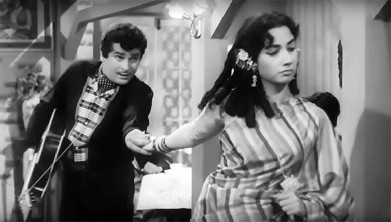
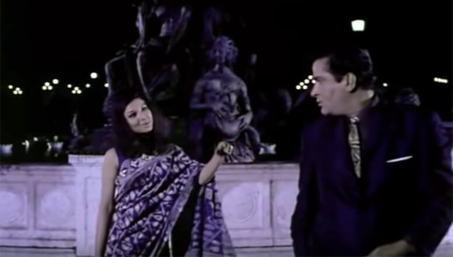
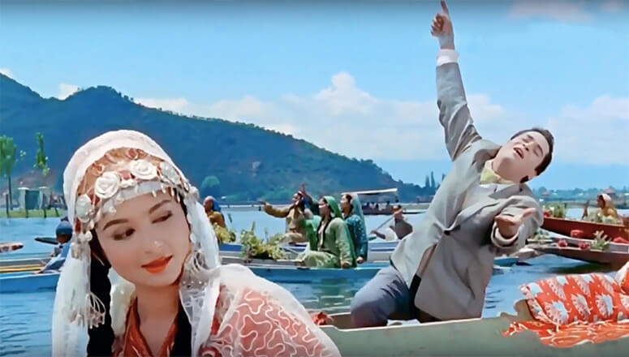
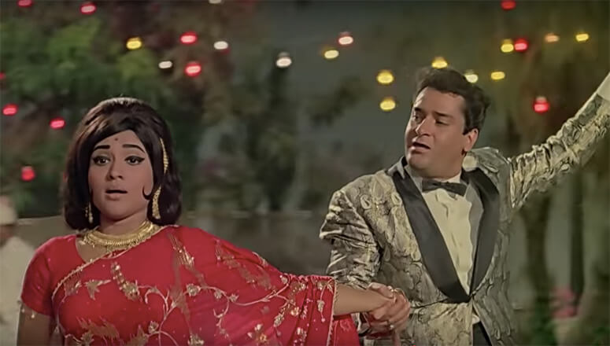
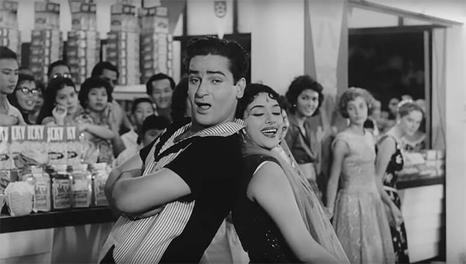

If Ranbir Kapoor is our rockstar, Ranveer Singh is our rap-star then Shammi Kapoor is definitely our retro-star! His movies from the 60s undeniably had the most foot-tapping music and his iconic Elvis Presley inspired hair plus dance moves took the 60s party vibe to an all new level. He basically taught India how to party back in the day!

His movies and songs were one of the first coloured films in Bollywood which portrayed stories ahead of its times. We’re here to celebrate the star that Shammi Kapoor was even before it was cool to be one. Here are our top favourite Shammiji movies you catch on Spuul.

<h3><a href="https://spuul.com/videos/1177295-china-town" rel="noopener">China Town</a></h3>

The song <em>Baar Baar Dekho</em> from this film is a beautiful representation of parties back in the day. Shammiji’s character Shekhar is wooing his love interest Rita played by Shakila in this song. It’s hard not to sing along to this peppy number as its lyrics stay relevant even today.

The story here is an interesting one, where a Darjeeling-based singer Shekhar follows his love Rita to Calcutta and finds himself working for the police as an undercover agent. His job is to impersonate his gangster lookalike Mike, who’s a China Town gangster.

<h3><a href="https://spuul.com/videos/222773-an-evening-in-paris" rel="noopener">An Evening In Paris</a></h3>

The romantic song <em>Raat Ke Humsafar</em> is an iconic number where Sharmila Tagore and Shammiji’s characters Deepa and Shyam walk on the lit streets of Paris.

An intriguing mystery surrounds the romance of Shyam and Deepa when Deepa gets abducted for ransom. She is then replaced in Shyam’s life by her look-alike called Roopa. Twins were the rage in the 60s it seems. Shyam eventually realises that Roopa isn’t Deepa and sets out to rescue his true love.

<h3><a href="https://spuul.com/videos/222757-kashmir-ki-kali" rel="noopener">Kashmir Ki Kali</a></h3>

The legendary tunes of <em>Yeh Chand Sa Roshan Chehra</em> are hard to let go of even to date. If you don’t know the entire lyrics to this song, are you even a Bollywood fan? Shammiji’s lovestruck character Rajeev and Sharmila Tagore’s coy Kashmiri girl act as Champa are a sight a behold!

In this coincidental story, a rich business tycoon Rajeev runs away to Kashmir to avoid marriage but promptly falls in love with a flower seller, Champa. Champa’s hand is then asked for marriage by a local contractor and things get a bit twisted. Later in the film, the two protagonists realise that they were exchanged as infants, where Rajeev’s father is Champa’s father and Champa is the real heiress to the Textile Empire.

<h3><a href="https://spuul.com/videos/729498-prince" rel="noopener">Prince</a></h3>

The super catchy and happening song <em>Badan pe Sitare</em> is from the film Prince starring Shammiji as Prince Shamsher Singh and Vyjayanthimala as Princess Amrita. Shammiji has an interesting way of pursuing his love with his retro dance moves and grooves.

Probably inspired by the Buddha story, the Prince here decides to leave his home to find the true meaning of life. For this, he fakes his death with an accident and everyone thinks he’s dead. But when he eventually turns back to his palace as a commoner he finds that his father has passed away and his evil stepmother and her son have taken over the throne.

<h3><a href="https://spuul.com/videos/825545-singapore" rel="noopener">Singapore</a></h3>

Taking us on a tour across the streets of Singapore are Shammiji and Padmini in the song <em>Hat Jao Deewane Aaye</em> while the locals watch them dance and romance the night away.

Shammiji’s character Shyam sends his manager to Singapore to sell off his rubber estate. But after Ramesh somehow disappears, Shyam flies to Singapore himself. However, when he reaches the country, he discovers that there’s a secret treasure buried under his estate and that a few gangsters are after it.

Apart from these gems, there are also movies like Ujala and Manoranjan on this iconic list. Enjoy the retro age with the retro-star <a href="https://spuul.com/stars/488-shammi-kapoor" rel="noopener">Shammi Kapoor</a> only on Spuul.
