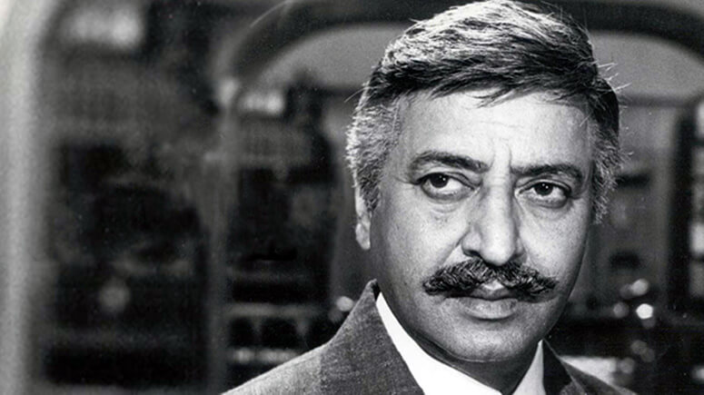
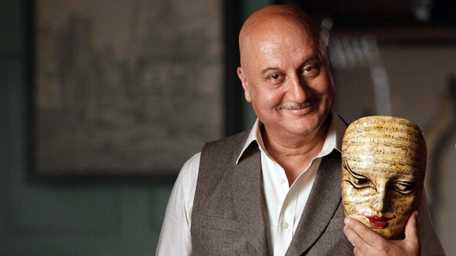
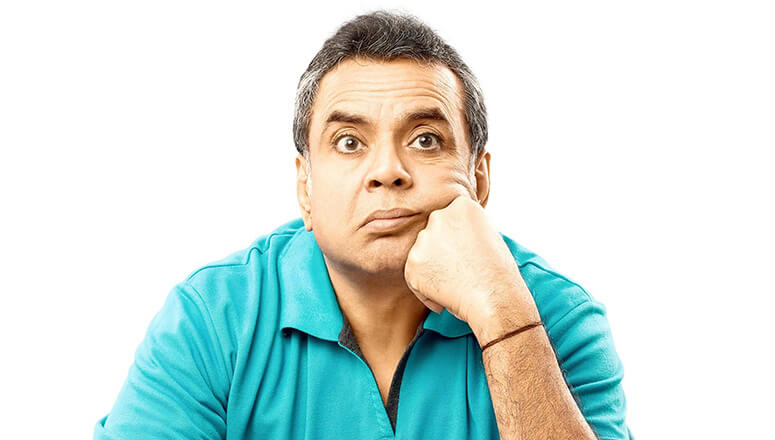

Character artists like Pran, Anupam Kher and Paresh Rawal laid the foundation for recent stars like Irfan Khan, Nawazuddin Siddiqui and Pankaj Tripathi, proving that most movies would be nothing without their strong and brilliant performances that add an edge to various storylines.

While a movie may never be remembered solely for these gems, we know their talent and passion makes their characters live on forever. They can play friendly, philosophical, romantic, hilarious, sensitive or downright despicable roles, but the one common element these outstanding performers bring to our screens is - versatility.

Call them subordinates, sidekicks or supporting actors, movies are incomplete without their dynamic acts and we’re here to give their journey a big shoutout for they have made Indian cinema what it is today.

<h3><a href="https://spuul.com/stars/478-pran" rel="noopener">Pran</a></h3>

Pran Kewal Sikand, known by the mononym Pran, chanced upon an acting career in 1940. After a brief struggle, he scored his Bollywood debut Ziddi. He gained popularity for his lean and mean roles in movies like Ram Aur Shyam, Milan, Heer Ranjha, Kashmir Ki Kali and more. He made his evil roles so believable and despicable that people stopped naming their kids "Pran".

But that was only the beginning of his reign, with Upkar in 1967 he broke the villain typecast by playing a positive and emotional role that set him free. Movies like Zanjeer, Don, Majboor, Naseeb, Amar Akbar Anthony and Karz are only a few examples of roles that followed. He played grey and somehow sensitive characters that were heroic in their own way. Be it the gambler who turns into a mechanic in Zanjeer, the family man who helps criminals to save his wife in Don, or the possessive caretaker who conceals a grave secret in Karz - Pran was a chameleon!  

Pran worked in 600+ movies in his skyrocketing career and outlasted the careers of many superstars like Dilip Kumar, Dev Anand, Amitabh Bachchan, Rishi Kapoor, etc. He was reportedly paid more than protagonists in the early 1970s due to his seniority in the industry. During the casting of Bobby, Raj Kapoor couldn't afford Pran, who then agreed to do the film with a signing amount of Re 1. He once stated, that if reincarnation exists, he’d like to be born as Pran all over again.

<h3><a href="https://spuul.com/stars/9-anupam-kher" rel="noopener">Anupam Kher</a></h3>

Anupam Kher was born in Shimla in 1955 and was inclined towards acting at a young age. With a gold medal in his theatre department at the college, he was then sent to National School Of Drama. Thereafter the future seemed bright for the fledgeling actor but he struggled as a Drama teacher in Lucknow and Mumbai until he scored his debut film Saaransh via Mahesh Bhatt. He played an old man in this film even though he was only a 28 year old at the time and was truly recognised for his seamless portrayal. So much so, he was offered around 100 roles within 10 days of its release.

It’s been a rollercoaster for Kher ever since, a rollercoaster that only goes up! Known for his versatility, he played a terrorist called Dr.Dang in Karma, a drunk father in Tezaab, a supportive best friend in Lamhe, a father/best friend in DDLJ, a hilarious college principal in Kuch Kuch Hota Hai, a naive father in Haseena Maan Jayegi, a criminal business tycoon in Kaho Na Pyaar Hai, a competitive lawyer in Veer Zaara, a responsible police agent in A Wednesday, a timid con man in Special 26 and lately former PM Manmohan Singh in An Accidental Prime Minister. Mind you, these are only a few of our favourite movies amongst Anupam Kher’s 400+ Bollywood films.

A stage artist, veteran actor, a TV host and now a prominent Hollywood actor, Kher has starred in the Oscar-nominated movie Silver Linings Playbook, a hit Netflix show Sense 8 and is currently working on the American drama series New Amsterdam. Oh and he also runs an Acting School in Mumbai. He is known for his love for cinema across borders and his accolades have touched the sky. Need we say more?

<h3><a href="https://spuul.com/stars/87-paresh-rawal" rel="noopener">Paresh Rawal</a></h3>

Paresh Rawal was born in Mumbai in 1950 and at the early age of 12, he had already decided to pursue an acting career. With support from his school and college principals, he took part in festivals and later joined theatre for a living. Being a natural stage artist, he was earlier stuck between doing parallel and commercial cinema but eventually found his ground in both.

He played negative roles at first in the movies Arjun, Naam, Ram Lakhan, Sir and more; but the film Andaz Apna Apna where he plays a hilarious double role of both a strict father and a villain brother AKA Tejaa, made him stand out. Though he always mixed humour with his roles, this movie was special. "<em>Main Tejaa hu, mark idhar hai</em>" is an iconic dialogue no Bollywood lover can ever forget! He then starred in legendary comic roles like a police inspector in Mohra, an inquisitive neighbour in Judaai, a funny uncle in Mr & Mrs Khiladi where he breaks the fourth wall and gives live updates like a news reporter(class act!), a nosy neighbour in Chachi 420, a sharp security guard in Haseena Maan Jayegi("<em>Jo Chacha Hai Wahi Bhatija Hai...</em>") and in year 2000 came his biggest hit Hera Pheri that won him a number of awards for the role of Baburao who’s comical dialogues and mannerisms left the audience in fits of laughter.

Then came a stream of Priyadarshan films where he made each character his own and no other actor could’ve done justice to those masterpieces. Hungama, Malamaal Weekly, Chup Chup Ke and Bhool Bhulaiya are our top picks from that list. But he did continue doing serious roles like playing a mean lawyer in Aitraaz, an atheist in Oh My God! and more recently Sunil Dutt in Sanju plus the vital role of National Security Advisor in Uri, that is currently creating much ‘josh’. Which makes us wonder, is there anything this man can’t pull off?

In recent years, we have actors like Irfan Khan, Nawazuddin Siddiqui and Pankaj Tripathi taking centre stage and being loved for what they do. Also joining the club is debutant Siddhanth Chaturvedi AKA MC Sher from the latest release Gully Boy who was brought forth as strongly as Ranveer Singh’s character Murad, proving that the term "supporting actor" can be dissolved into just "actor" now.
